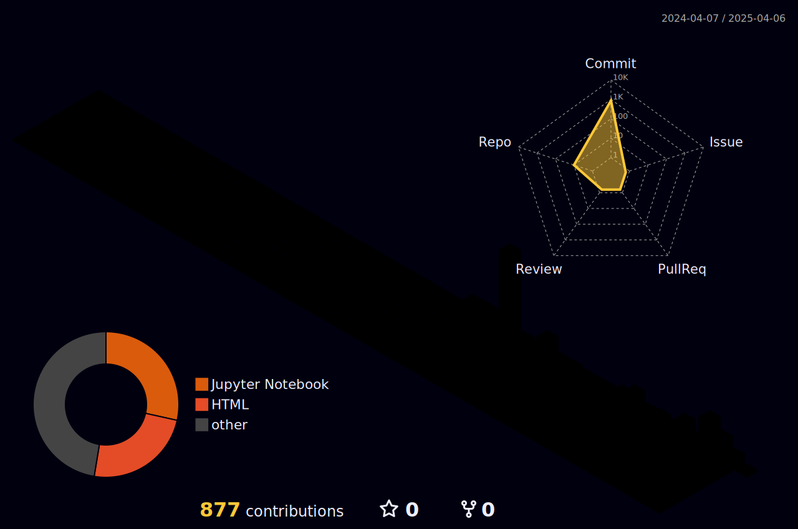

<h1 align="center"> <!-- Can change to "left" or "right" -->

  Hi !  I am <a href="#">KMY-06</a> 🌱 I live on <a href="https://github.com" title="GitHub"> GitHub 🏠 </a>

</h1> 
 
   

<!-- This is the link for the 3D thing (open in chrome for google translate):    https://h-owo-ld.tistory.com/264   -->

<!-- 
When you click 'run workflow' if it shows E.g 'remote: Permission to kmy-06/kmy-06.git denied to github-actions[bot].' :
1. Go to your repository and open the 'settings' located after 'insights'.
2. Then go to 'Actions' > 'General'.
3. Under Workflow Permissions, check 'Read and write permissions', and save to run again.
-->

<!--

<!--
Add this between 'pytorch' and ')' for light mode icons :P ->    &theme=light
-->

